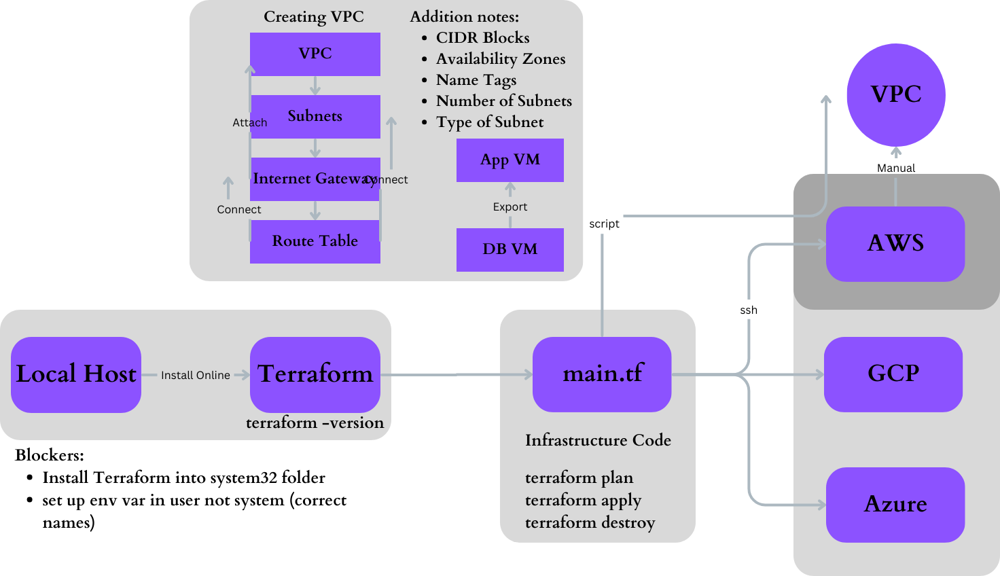

# Orchestration / Terraform

## Terraform Diagram



## Orchestration

### What is Orchestration?

- Orchestration is the automated configuration, management, and coordination of computer systems, applications, and services. Orchestration helps IT to more easily manage complex tasks and workflows.  
https://www.redhat.com/en/topics/automation/what-is-orchestration

### Why use Orchestration?

- DevOps orchestration enables your teams to implement continuous quality control activities such as approval checks, scheduling, security testing, and automatic status reporting.

### When does Orchestration occur in DevOps?

- 
Orchestration in DevOps happens during deployment and automation processes, coordinating tasks and tools for efficient, automated, and error-free workflows.

### Who uses Orchestration?

- Orchestration is used by businesses to streamline processes and manage workflows, ensuring efficient coordination of tasks and resources.

### How do we use Orchestration?

- DevOps engineers use orchestration to automate and streamline software deployment, configuration, and management tasks across the development and operations lifecycle.

### Why Invest in DevOps Orchestration?
DevOps teams must navigate across departments, requiring a solution where their tools can also be piloted smartly. This situation calls for DevOps orchestration solutions, which have the ability to combine numerous automated elements from different DevOps toolkits. 

With DevOps orchestration, teams can utilize their current in-use automation tools while being able to engage under an overarching umbrella designed to pull everything into a single workflow.  
https://katalon.com/resources-center/blog/devops-orchestration-investment


### How does Orchestration link to Terraform?

- Orchestration addresses the needs to automate the lifecycle of environments. With infrastructure being codified, modifications of infrastructure are automated and Terraform is used to establish infrastructure across multi-cloud and on-prem data.


## Terraform

### What is Terraform?

- Terraform creates and manages resources on cloud platforms and other services through their application programming interfaces (APIs). Providers enable Terraform to work with virtually any platform or service with an accessible API.   
https://developer.hashicorp.com/terraform/intro

### What does terraform mean?

- Terraform is an IAC tool, used primarily by DevOps teams to automate various infrastructure tasks.

### Why should we learn Terraform/benefits?

- Terraform is used to manage and provision infrastructure across a variety of cloud providers such as AWS, Azure, Google Cloud, and more.

- Using Terraform provides many benefits, including version control for infrastructure, the ability to automate infrastructure provisioning, and the ability to codify infrastructure.

### Who is using Terraform?

- AWS
- Cloudflare
- Microsoft Azure
- IBM Cloud
- Serverspace
- GCP
- Digital Ocean
- Oracle Cloud
- Yandex

## Commands to use on terraform and how they work.

```
terraform
```
This command will determine if terraform is installed or not. This command will also provide all the commands available on terraform.  
- Ensure that your downloaded file is in the correct directory
- Ensure the folder is unzipped

```
terraform -version
```
This command shows the version of terraform you are using

```
terraform init
```
This command initializes a working directory in your current folder
- Make sure it's a new empty folder

```
nano main.tf
```
This file will enter the file name listed, if it already exists it will open that file.
- Keep the name simple
- .tf stands for terraform
```
terraform plan
```
This command will check your configuration and detect any syntax errors
- Ensure that your aws credentials are set up correctly in environment settings. If you change them restart your Bash terminal (As Admin).
```
terraform apply
```
This command will create or update infrastructure 
- In this case building an ec2 instance
- If creating on cloud provider you will need to confirm yes (DO NOT FORCE IT)

```
terraform destroy
```
This command will destroy any previously-created infrastructure
- In this case destroying the EC2 instance created.
- Type yes to confirm (DO NOT FORCE)